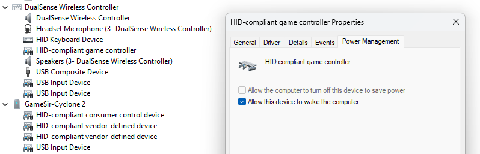
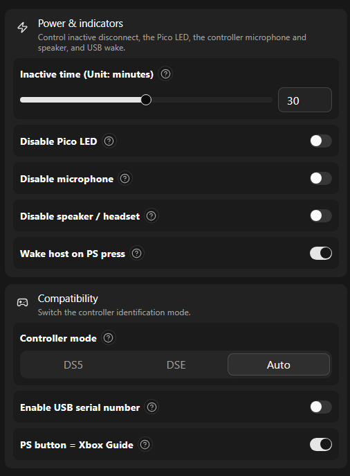
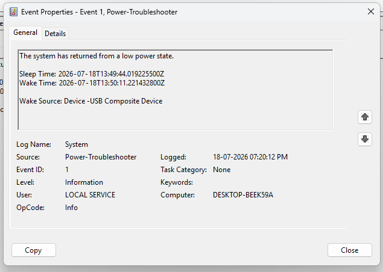
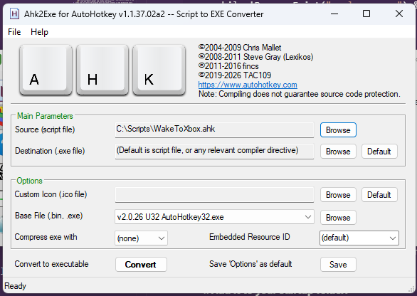

# WakeToXbox

Seemless PC -> Xbox experience with controller wake

<!-- Repo badges placeholder: uncomment and update when published
[](LICENSE)
[](https://www.autohotkey.com/)
-->

---

## Step 1: Enable Full Screen Experience and Auto Boot

First, open your Settings, go to Gaming, and select **Xbox Mode** → toggle on **Enable Xbox Mode**.

If you don't see Xbox Mode, update Windows to the latest version. Then install and enable it with ViVe: https://github.com/thebookisclosed/ViVe/releases

If you ever need to do this manually, you can just press `Win+F11`.


## Step 2: Skip Sign-in Completely

Next, we need to bypass the lock screen.
- Press **Win+R**, type `netplwiz`, and uncheck the box that says **"Users must enter a user name and password"**.
- Then, go to **Settings > Accounts > Sign-in options**. Find the setting that asks *"If you've been away, when should Windows require you to sign in again?"* and change it to **Never**.

> ⚠️ **Warning:** Keep in mind that anyone who wakes your PC will have immediate access to it. It's a tradeoff for a seamless living-room experience.

---

## Step 3: Allow the Controller to Wake the PC

You will need to change some settings in your BIOS and in Windows.

**In your BIOS** (the wording might be different depending on your motherboard, but this is how it looks on MSI):

| Setting | Value |
|---|---|
| Wake Up Event Setup > "Wake Up Event By" | **BIOS** |
| Wake Up Event Setup > "Resume By USB Device" | **Enabled** |
| Power Management Setup > "ErP Ready" | **Disabled** |

**In Windows:**

- You'll want to disable **USB selective suspend**. Go to Settings > System > Power > Additional power settings > Change plan settings > Change advanced > USB settings, and set USB selective suspend to **Disabled**.
- Disable **Fast Startup** as well. Open the Control Panel, go to Power Options > "Choose what the power buttons do", click "Change settings that are currently unavailable", and uncheck **"Turn on fast startup"**.

- Finally, open **Device Manager**, find your controller adapter, it should be named something like HID-compliant game controller or similar, right-click it and choose Properties. Under the Power Management tab, check the box that says **"Allow this device to wake the computer"**. (For easier sorting, in Device Mgr, Go to View > Devices by Container)



**For DS5Dongle Users:** If you are using a DualSense with a DS5Dongle, go to [https://ds5.awalol.eu.org/](https://ds5.awalol.eu.org/) and enable the wake feature in the settings.




**Note:** Keep in mind that this only wakes your PC from **sleep** mode. It's impossible to do a cold boot from a full shutdown over USB.

You should also check the Power Management tab for your Wi-Fi adapter. Mine was waking the PC randomly due to network traffic until I turned that feature off!

---

## Step 4: Launch the Full Screen Experience Only on Controller Wake

### Finding your wake source

The script needs to know the exact name your controller dongle uses when it wakes the PC. Here is how to find it:

1. **Put your PC to sleep** from the Start menu.
2. **Wake it up with your controller** by pressing any button, and wait for the PC to fully turn on.
3. **Open the Event Viewer** by pressing `Win+R`, typing `eventvwr.msc`, and hitting Enter.
4. **Navigate to** Windows Logs and then click on **System**.
5. **Find the wake event**. Look for a recent event where the Source is **Power-Troubleshooter** and the Event ID is **1**. You can use the "Filter Current Log" option on the right to narrow it down quickly.
6. **Click the event**, go to the **Details** tab, and select **Friendly View**.
7. **Find the `WakeSourceText` field**. This is the specific text you need. It might say something like `USB Composite Device` or `HID-compliant game controller`.
8. **Copy that text exactly** because you will need to paste it into the script below.



### Editing the script

In the script provided below, look for this specific line:

```ahk
            if InStr(wakeText, "USB Composite Device")
```

Change `USB Composite Device` to the exact `WakeSourceText` you found earlier. For example, if your wake source was `HID-compliant game controller`, it would look like this:

```ahk
            if InStr(wakeText, "HID-compliant game controller")
```

### The script

This is an [AutoHotkey v2](https://www.autohotkey.com/) script. You will need to compile it and put a shortcut to the `.exe` file in your startup folder. Don't worry, the instructions for that are below!

**How to get the script:**
- You can **copy and paste** the code block below into a new file named `WakeToXbox.ahk`.
- Or, you can **clone the repository** to grab all the files at once.

```ahk
#Requires AutoHotkey v2.0
#SingleInstance Force
Persistent

OnMessage(0x218, PowerBroadcast)  ; WM_POWERBROADCAST

PowerBroadcast(wParam, lParam, msg, hwnd) {
    if (wParam = 0x12)  ; PBT_APMRESUMEAUTOMATIC
        SetTimer(HandleWake, -100)
}

HandleWake() {
    wakeStamp := DateAdd(A_NowUTC, -5, "Seconds")

    ; This black overlay hides the desktop during the transition
    overlay := Gui("+AlwaysOnTop -Caption +ToolWindow")
    overlay.BackColor := "Black"
    overlay.Show("x0 y0 w" . A_ScreenWidth . " h" . A_ScreenHeight)

    tmpFile := A_Temp . "\wakecheck.txt"
    cmd := 'wevtutil qe System "/q:*[System[Provider[@Name=' . "'Microsoft-Windows-Power-Troubleshooter'" . '] and (EventID=1)]]" /c:1 /rd:true /f:xml'

    matched := false
    deadline := A_TickCount + 12000
    while (A_TickCount < deadline) {
        RunWait(A_ComSpec . ' /c ' . cmd . ' > "' . tmpFile . '"', , "Hide")
        wakeText := ""
        if FileExist(tmpFile)
            wakeText := FileRead(tmpFile)

        eventStamp := ""
        if RegExMatch(wakeText, "SystemTime='(\d{4})-(\d{2})-(\d{2})T(\d{2}):(\d{2}):(\d{2})", &m)
            eventStamp := m[1] . m[2] . m[3] . m[4] . m[5] . m[6]

        if (eventStamp != "" && eventStamp >= wakeStamp) {
            if InStr(wakeText, "USB Composite Device")
                matched := true
            break  ; We found a fresh event, so we can stop checking
        }
        Sleep(750)  ; The event is stale, so we keep checking
    }

    if !matched {
        overlay.Destroy()
        return
    }

    timeout := A_TickCount + 6000
    while !ProcessExist("explorer.exe") && (A_TickCount < timeout)
        Sleep(200)
    Sleep(500)

    Send("#{F11}")
    Sleep(3000)
    overlay.Destroy()
}
```

### Compiling and installing

1. **Install AutoHotkey v2**. Download it from [autohotkey.com](https://www.autohotkey.com/) and run the installer. Make sure you select version **2**, not version 1.
2. **Open Ahk2Exe**. Once installed, search for `Ahk2Exe` in your Start menu. 
3. **Compile the script:**
   - For the **Source**, browse and select your `WakeToXbox.ahk` file.
   - For the **Destination**, pick where you want to save the new `.exe` file.
   - Click **Convert**.



4. **Add it to your startup folder:**
   - Press `Win+R`, type `shell:startup`, and press Enter to open your Startup folder.
   - Right-click anywhere inside the folder, select **New > Shortcut**, browse to the `.exe` file you just created, and finish the setup.
5. **You are all set!** The program will now start silently in the background every time you log in.

The background script barely uses any resources since it's event-driven and doesn't poll while the PC is asleep.

---

## TL;DR

Turn on the Full Screen Experience and auto boot, set Windows to skip the sign-in screen, enable USB wake in your BIOS (make sure your dongle firmware supports it!), and run a simple AutoHotkey script in the background. The script checks the wake source and activates the Xbox interface seamlessly.

If you have any questions, feel free to reach out to me, contant info [here](https://alen.is)