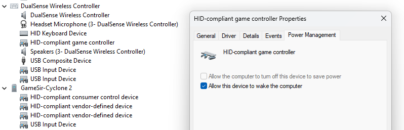
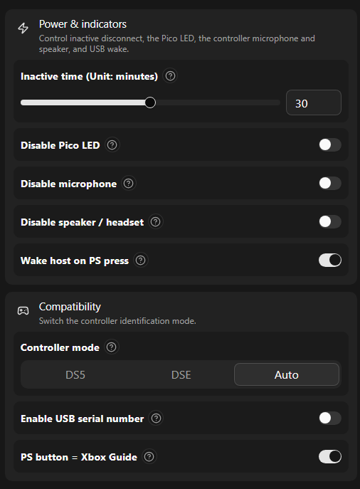

# WakeToXbox

Seamless PC -> Xbox experience with controller wake

Press a button on your controller and your sleeping PC wakes straight into the Xbox Full Screen Experience

---

## Setup

Every install needs these three things set up once. The app handles the rest.

### 1. Enable Full Screen Experience and auto boot

Open Settings, go to Gaming, and select **Xbox Mode** → toggle on **Enable Xbox Mode**.

If you don't see Xbox Mode, update Windows to the latest version. Then install and enable it with ViVe: https://github.com/thebookisclosed/ViVe/releases

If you ever need to trigger it manually, press `Win+F11`.

### 2. Skip sign-in completely

- Press **Win+R**, type `netplwiz`, and uncheck **"Users must enter a user name and password"**.
- Go to **Settings > Accounts > Sign-in options** and set *"If you've been away, when should Windows require you to sign in again?"* to **Never**.

> ⚠️ **Warning:** Anyone who wakes your PC will have immediate access to it. It's a tradeoff for a seamless living-room experience.

### 3. Allow the controller to wake the PC

**In your BIOS** (wording varies by motherboard; this is how it looks on MSI):

| Setting | Value |
|---|---|
| Wake Up Event Setup > "Wake Up Event By" | **BIOS** |
| Wake Up Event Setup > "Resume By USB Device" | **Enabled** |
| Power Management Setup > "ErP Ready" | **Disabled** |

**In Windows:**

- Disable **USB selective suspend**: Settings > System > Power > Additional power settings > Change plan settings > Change advanced > USB settings.
- Disable **Fast Startup**: Control Panel > Power Options > "Choose what the power buttons do" > uncheck **"Turn on fast startup"**.
- In **Device Manager**, find your controller adapter (something like HID-compliant game controller), open Properties > Power Management, and check **"Allow this device to wake the computer"**. (Tip: View > Devices by Container makes it easier to find.)



**For DS5Dongle users:** If you use a DualSense with a DS5Dongle, go to [https://ds5.awalol.eu.org/](https://ds5.awalol.eu.org/) and enable the wake feature in the settings.



**Note:** This only wakes the PC from **sleep**. A cold boot from full shutdown over USB isn't possible.

Also check the Power Management tab of your Wi-Fi adapter — network traffic can wake the PC randomly until you turn that off.

---

## For users

1. Download `WakeToXboxApp.exe` from the [releases page](https://github.com/AlenVelocity/WakeToXbox/releases) and run it. It lives in the system tray and opens its settings on first launch.
2. Pick your wake source: put the PC to sleep, wake it with the controller, hit **Refresh** in the settings window, and click the newest entry in the list.
3. Check **"Start WakeToXbox automatically when I sign in to Windows"** and hit **Save**.

That's it. Next time the controller wakes the PC, Xbox mode launches on its own.

Extras: a **Test now** button runs the whole sequence without sleeping the PC, and the tray menu lets you toggle the automation or launch Xbox mode manually. The app is fully event-driven — it uses no resources until Windows reports a wake.

If something isn't triggering, check `%LocalAppData%\WakeToXbox.log` — it records every wake signal, the wake source Windows reported, and why it matched or didn't.

### Modern Standby (S0) laptops

Most desktops sleep with **S3**, where Windows logs exactly which USB device woke the PC — that's what the wake-source picker above shows. Laptops (and some desktops) that use **Modern Standby** instead never log that; Windows only records a generic exit reason, not the specific device. WakeToXbox falls back to those reason codes automatically, but on Modern Standby it can't always tell your controller apart from other USB devices — an entry like "Modern Standby wake: PoSetSystemState" can mean *any* non-keyboard/mouse USB device caused the wake, not just the controller. If Xbox mode launches on wakes it shouldn't, this is why. Run `powercfg /a` to see which sleep states your PC actually supports.

## For developers

Everything is plain C# (WinForms, .NET Framework 4.8) compiled with the toolchain that ships with Windows.

```powershell
git clone https://github.com/AlenVelocity/WakeToXbox.git
cd WakeToXbox
powershell -ExecutionPolicy Bypass -File WakeToXboxApp\build.ps1
```

This generates the multi-size app icon from `assets/icon.png` and produces `WakeToXboxApp.exe` in `dist/`.

Source layout (`WakeToXboxApp/`):

| File | Purpose |
|---|---|
| `Program.cs` | Entry point, single-instance guard |
| `TrayContext.cs` | Tray icon, wake-event handling, Win+F11 dispatch |
| `WakeEvents.cs` | Reads wake events from the System log (Power-Troubleshooter on S3, Kernel-Power on Modern Standby) |
| `SettingsForm.cs` | Settings window with the wake-source picker |
| `OverlayForm.cs` | Fullscreen black overlay shown during the transition |
| `Config.cs` | Registry-backed settings and autostart |
| `build.ps1` | Icon generation + compilation |

How it works: a hidden window listens for both `WM_POWERBROADCAST` resume messages and display-on power notifications (the latter also fires reliably on Modern Standby). On a wake signal, the app reads the newest matching System log event to see *what* caused it, waits out any lock screen, and if the source matches your controller it sends Win+F11 — with a black overlay hiding the desktop during the transition. A dedup check keeps a single physical wake from re-triggering the sequence when both signals fire for it.

## The old way (scripts)

The original AutoHotkey and PowerShell scripts still work and live in [legacy/](legacy/). Full instructions are on the [wiki](https://github.com/AlenVelocity/WakeToXbox/wiki/Instructions). Note that some anti-cheat systems don't play nice with AutoHotkey — the app avoids that entirely.

---

## TL;DR

Turn on the Full Screen Experience and auto boot, set Windows to skip the sign-in screen, enable USB wake in your BIOS (make sure your dongle firmware supports it!), and run the WakeToXbox tray app. It checks the wake source and activates the Xbox interface seamlessly.

If you have any questions, feel free to reach out to me, contact info [here](https://alen.is)
